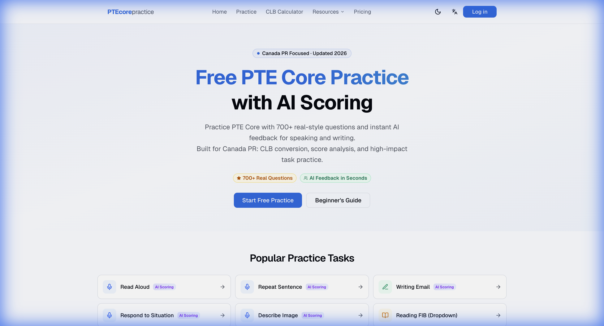
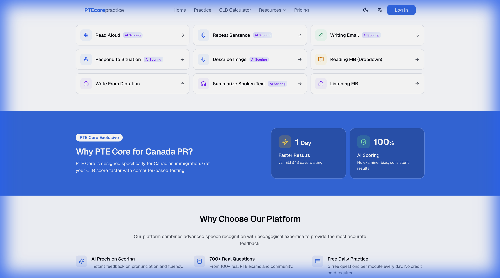
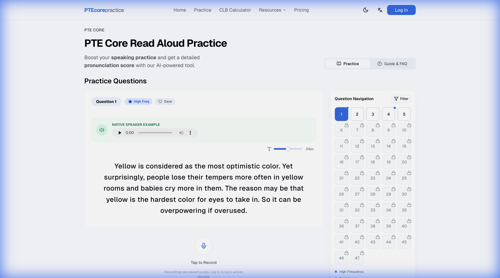

# PTECorePractice

### Free PTE Core Practice Tests with AI Scoring for Canada PR

**🌐 [ptecorepractice.com](https://ptecorepractice.com)**

The #1 free PTE Core practice platform with instant AI-powered scoring.  
Helping thousands of Canada PR applicants achieve their target CLB scores.

---

## 📸 Screenshots

### Homepage

### Practice Tasks

### AI-Powered Practice Interface

---

## ✨ Features

| Feature | Description |
|---------|-------------|
| 🎤 **AI Scoring** | Instant pronunciation & fluency feedback powered by professional speech assessment |
| 📚 **700+ Real Questions** | Sourced from 100+ real PTE Core exams and community contributions |
| 🆓 **Free Daily Practice** | 5 free questions per module every day — no credit card required |
| 📱 **Mobile Ready** | Fully responsive — practice on phone, tablet, or desktop |
| 📊 **Detailed Analytics** | Track pronunciation, fluency, and content scores over time |
| 🌙 **Dark Mode** | Easy on the eyes during late-night study sessions |
| 🔐 **Privacy First** | Audio processed securely, never stored or sold |

## 🎯 Supported Question Types

PTECorePractice covers **12 PTE Core question types** across all sections:

### Speaking
- ✅ Read Aloud (AI Scored)
- ✅ Repeat Sentence (AI Scored)
- ✅ Describe Image (AI Scored)
- ✅ Respond to Situation (AI Scored)

### Writing
- ✅ Writing Email (AI Scored)
- ✅ Summarize Written Text

### Reading
- ✅ Reading FIB (Dropdown)
- ✅ Reading & Writing FIB

### Listening
- ✅ Write From Dictation
- ✅ Summarize Spoken Text (AI Scored)
- ✅ Listening FIB
- ✅ Highlight Correct Summary

## 🧮 Free Tools

- **[CLB Calculator](https://ptecorepractice.com/pte-core-score-to-clb)** — Convert PTE Core scores to CLB instantly
- **[CRS Calculator](https://ptecorepractice.com/crs-calculator)** — Estimate your Express Entry CRS points
- **[Templates & Tips](https://ptecorepractice.com/pte-core-templates-and-tips)** — High-score speaking & writing templates

## 📖 Resources

- 📘 [PTE Core Beginner's Guide](https://ptecorepractice.com/pte-core-beginners-guide) — Complete guide for new test takers
- 🇨🇦 [PTE Core for Canada PR](https://ptecorepractice.com/pte-core-canada-pr) — IRCC acceptance & PR pathways
- 📅 [Test Booking Guide](https://ptecorepractice.com/pte-core-test-booking) — Step-by-step booking in Canada
- 📊 [PTE Core vs IELTS](https://ptecorepractice.com/pte-core-vs-ielts) — Which test is right for you?

## 🚀 Why PTE Core?

PTE Core is the **fastest path to Canada PR language proof**:

- ⚡ **Results in 1–2 days** (vs. IELTS 13 days)
- 🤖 **100% AI-scored** — no examiner bias
- 🇨🇦 **Accepted by IRCC** for all immigration programs
- 💻 **Computer-based** — consistent testing experience

## 💬 Feedback & Contact

We'd love to hear from you!

- 🐛 **Bug Reports**: [Open an Issue](../../issues)
- 💡 **Feature Requests**: [Open an Issue](../../issues)
- 📧 **Email**: [Contact Us](https://ptecorepractice.com)

## ⭐ Support the Project

If PTECorePractice helped you with your PTE Core preparation, please consider giving us a ⭐ star on GitHub!

---

**Built with ❤️ for the Canada PR community**

[🌐 Visit PTECorePractice.com](https://ptecorepractice.com)

